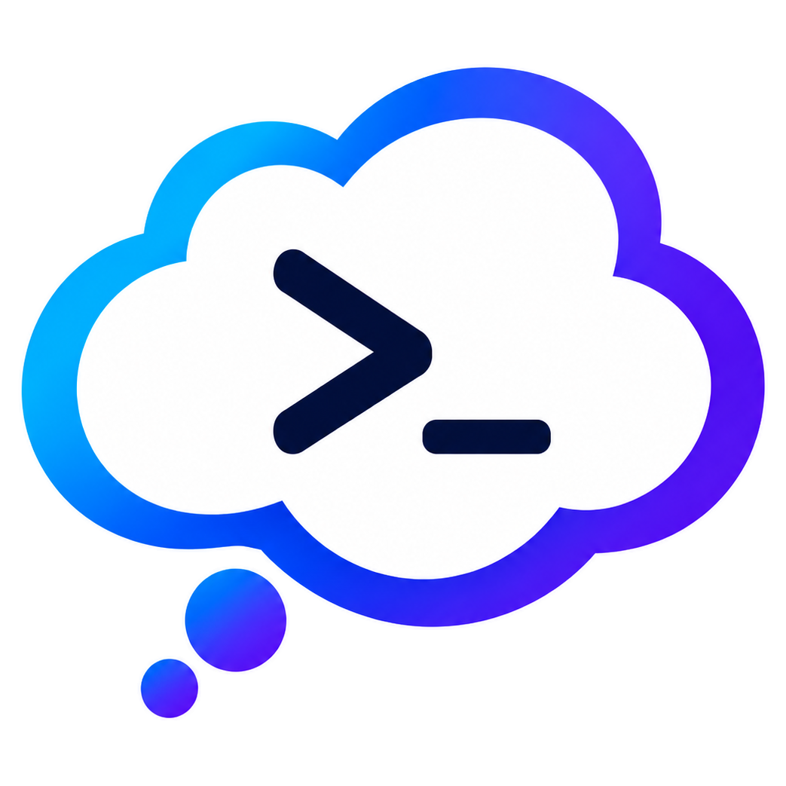

# Codex Mission Control

<p align="center">
  
</p>

<p align="center">
  <a href="https://github.com/MN755/Codex-Mission_Control/actions/workflows/package-desktop.yml"></a>
  <a href="https://github.com/MN755/Codex-Mission_Control/releases"></a>
  <a href="https://www.python.org"></a>
  <a href="LICENSE"></a>
  <a href="https://github.com/MN755/Codex-Mission_Control/stargazers"></a>
  <a href="https://github.com/MN755/Codex-Mission_Control/forks"></a>
</p>

<p align="center">
  
  
  
  
  
  
</p>

<p align="center"><strong>One chat. One manager. Many agents. No orchestration circus.</strong></p>

<p align="center">
  Codex Mission Control turns Codex chat into a real control bridge for background agent swarms, approvals, diagnostics, and evidence-backed handoffs.
  You stay in one conversation. Mission Control handles the coordination mess behind the scenes.
</p>

## Why people want this

Most multi-agent coding setups look impressive right up until they start doing real work. Then the usual nonsense shows up:

- agents drift out of scope
- two workers edit the same files
- test evidence gets lost
- approvals become hand-wavy
- context dies between iterations
- the "manager" is just a chat model improvising in public

Mission Control fixes that by moving orchestration into a local daemon with a real state model. Codex chat stays clean. The Manager AI stays inside Mission Control. Worker runners stay behind policy, approvals, and evidence requirements.

This is the pitch in one sentence:

> Mission Control gives you the feeling of a coordinated engineering team without the usual AI-agent chaos tax.

## What makes Mission Control different

- **Headless-first, chat-native**: the product center is the chat workflow, not a dashboard dependency.
- **A real orchestration runtime**: project state, approvals, handoffs, diagnostics, and recovery are daemon-owned.
- **Manager AI with guardrails**: one manager plans the work; workers do not freelance into anarchy.
- **Evidence over vibes**: validation summaries, handoff evidence, and verification briefs exist so "it should work" stops counting as engineering.
- **Works with existing repos**: attach a real codebase, intake it safely, and start from there instead of from fantasy greenfield demos.
- **Local-first by default**: Codex CLI, Claude CLI, Ollama, and API-backed runners can all fit, but the system does not pretend billing, auth, or runtime limits do not exist.
- **Browser automation lane included**: Webwright support gives Mission Control a serious browser-task path when the runtime is actually installed.

## What you get

### A cleaner way to run big coding tasks

- one Codex chat as the operator bridge
- one Manager AI as the planner and coordinator
- multiple worker agents behind approvals and runner policy
- compact status, event, and handoff summaries instead of raw noise

### Better control when things get messy

- pending decisions and approval relay
- operator snapshot, instincts, and verification brief surfaces
- recovery planning and restart-safe orchestration state
- path locks, risk registers, and validation summaries

### A system that can actually grow with the project

- existing-codebase import and understanding
- adaptive swarms with coordination guardrails
- plugin packaging, MCP tools, resources, and prompts
- Codex-first bridge workflows with Claude Code support

## How it feels in practice

From a Codex chat in your project folder:

```text
Install Mission Control from https://github.com/MN755/Codex-Mission_Control and wire it up.
```

Then:

```text
Use Mission Control for this repo and fix the failing tests.
```

Useful follow-up prompts:

```text
Show Mission Control status.
Show Mission Control operator snapshot.
Show Mission Control verification brief.
Show pending Mission Control approvals.
Get the latest Mission Control handoff.
Use Mission Control for a browser task with Webwright when available.
```

## The flow

```text
You
  ->
Codex chat
  ->
Mission Control plugin / MCP bridge
  ->
Mission Control daemon
  ->
Manager AI
  ->
Worker agents / runners
```

Core boundaries:

- Codex chat is the user-facing bridge.
- Mission Control daemon owns orchestration state.
- The Manager AI lives inside Mission Control.
- MCP tools act, MCP resources summarize, and MCP prompts guide.
- Worker agents stay behind Mission Control approvals and runner policy.

## Feature highlights

### Multi-agent orchestration without tab hell

Mission Control lets one chat drive a background swarm instead of making you babysit separate agent sessions like a human process scheduler.

### Operator-ready visibility

Mission Control exposes:

- status
- event digests
- operator snapshot
- operational instincts
- verification brief
- diagnostics
- handoff summaries

That means the user sees what matters now, what is blocked, and what still needs proof.

### Runner flexibility without fake readiness

Mission Control can work with:

- `codex_cli`
- `claude_cli`
- `ollama`
- `openai_api`
- `anthropic_api`
- `xai_api`
- `dry_run`

It also detects optional Webwright readiness for browser-agent tasks. If a runtime is missing, Mission Control says so plainly instead of cosplaying as finished.

### Safety that is actually useful

- localhost-only daemon binding by default
- explicit high-risk approvals
- no raw secrets in normal bridge summaries
- read-only resource surfaces for status and diagnostics
- evidence-focused handoffs instead of pretty fiction

## Quick start

1. Open Codex in your project folder.
2. Ask it to install and wire up Mission Control from this repo.
3. Force-quit and reopen the host app if plugin or MCP wiring changed.
4. Start a Mission Control task from chat.
5. Approve or answer pending decisions as they appear.
6. Review the handoff when the run reaches a checkpoint or completion.

## Who this is for

- developers who want AI help on real repositories, not toy demos
- people tired of losing context between agent iterations
- teams that want approvals, evidence, and handoffs instead of agent theater
- users who want local-first orchestration with flexible runner choices

## Documentation

### Start here

- [Overview](docs/OVERVIEW.md)
- [Quick Start](docs/QUICK_START.md)
- [Docs Index](docs/README.md)

### Core runtime

- [Background Architecture](docs/HEADLESS_ARCHITECTURE.md)
- [Background Install](docs/HEADLESS_INSTALL.md)
- [Codex Chat Mode](docs/CODEX_CHAT_MODE.md)
- [MCP Plugin Bridge](docs/MCP_PLUGIN_BRIDGE.md)

### Operator surfaces

- [MCP Tools](docs/MCP_TOOLS.md)
- [MCP Resources](docs/MCP_RESOURCES.md)
- [MCP Prompts](docs/MCP_PROMPTS.md)
- [Background Health](docs/HEADLESS_HEALTH.md)
- [Troubleshooting](docs/TROUBLESHOOTING.md)

### Runners and browser automation

- [Runners](docs/RUNNERS.md)
- [Autowire Providers](docs/AUTOWIRE_PROVIDERS.md)
- [Webwright Companion](docs/WEBWRIGHT.md)

### Public docs

- [GitHub Wiki](https://github.com/MN755/Codex-Mission_Control/wiki)

## Current status

Mission Control is designed first for background running through Codex chat.

- **Current**: daemon-oriented orchestration, plugin and MCP bridge packaging, skill library, pending decision relay, diagnostics, operator surfaces, chat-native handoffs, Webwright readiness lane
- **Partial / experimental**: deeper runner coverage, more orchestration hardening, broader provider polish
- **Optional / future**: standalone dashboard observability

## Contributing

Contributions should match the product direction: Codex chat is the bridge, and Mission Control daemon is the orchestration runtime.

- [Contributing guide](CONTRIBUTING.md)
- [Development docs](docs/CONTRIBUTING.md)
- [Security policy](SECURITY.md)
- [Support](SUPPORT.md)
- [Changelog](CHANGELOG.md)

## License

This project is licensed under the [MIT License](LICENSE).
